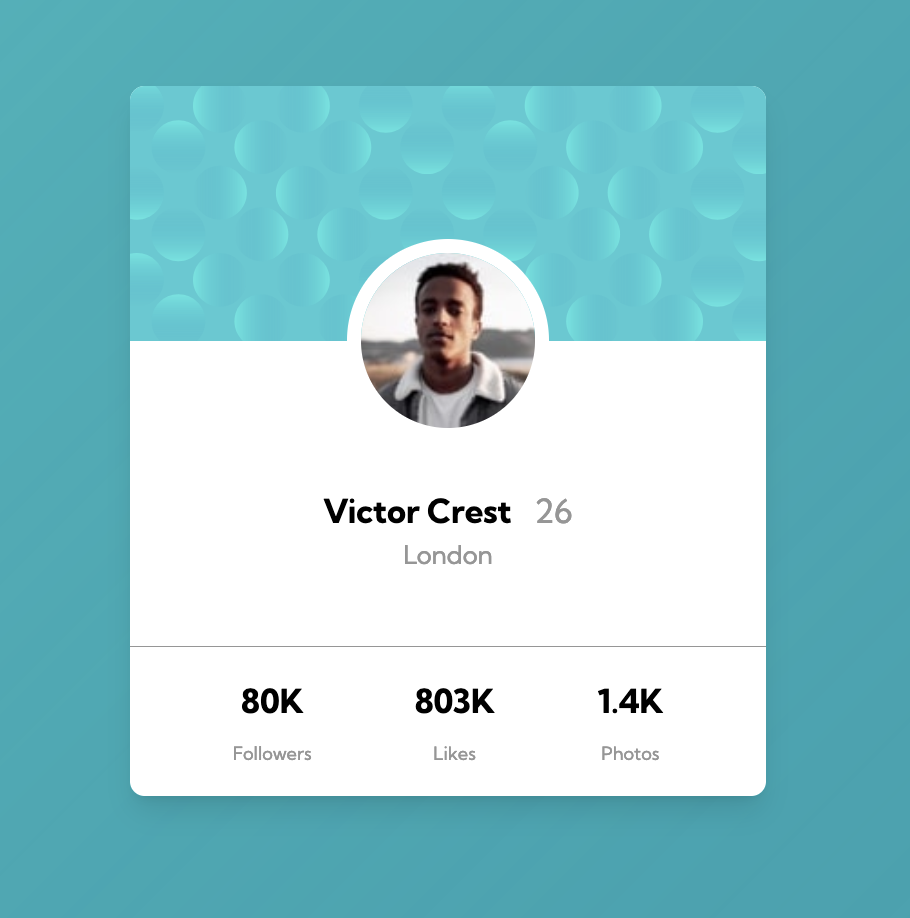

# Frontend Mentor - Profile card component solution

This is a solution to the [Profile card component challenge on Frontend Mentor](https://www.frontendmentor.io/challenges/profile-card-component-cfArpWshJ). Frontend Mentor challenges help you improve your coding skills by building realistic projects.

## Table of contents

- [Overview](#overview)
  - [The challenge](#the-challenge)
  - [Screenshot](#screenshot)
  - [Links](#links)
- [My process](#my-process)
  - [Built with](#built-with)
  - [What I learned](#what-i-learned)
  - [Continued development](#continued-development)
  - [Useful resources](#useful-resources)
- [Author](#author)
- [Acknowledgments](#acknowledgments)

**Note: Delete this note and update the table of contents based on what sections you keep.**

## Overview

- A small Frontend Mentor challenge using HTML and CSS.

### The challenge

- Build the card using HTML, CSS and CSS Flex-box.

### Screenshot



### Links

- Solution URL:

- Live Site URL: https://fem-profile-card-site.netlify.app/

## My process

- My process used Visual Studio Code, Firefox Developer Edition web browser and the design was with Figma.

### Built with

- Semantic HTML5 markup
- CSS custom properties
- Flexbox

### What I learned

One aspect I found challenging was placing the avatar image in the centre of the card. This was done by making the card image container with the SVG pattern relative position. The avatar itself then was in absolute position. The translate property has to be used as it does not centre exactlty without it. The HTML and CSS code is below

```html
<!-- image container -->
<div class="card-img-container">
  <!-- img -->
  
  <!-- card avatar -->
  <div class="avatar">
    
  </div>
</div>
```

```css
.card-img-container {
  position: relative;
  margin-bottom: 4rem;
}
.avatar {
  position: absolute;
  left: 50%;
  bottom: 0;
  transform: translate(-50%, 50%);
  border-radius: 50%;
  border: solid white 0.5rem;
  overflow: hidden;
}
```

### Continued development

- Continue to use and learn Flexbox is essential. When to use it and when not to use it.

## Author

- Frontend Mentor - https://www.frontendmentor.io/profile/John-Davidson-8
